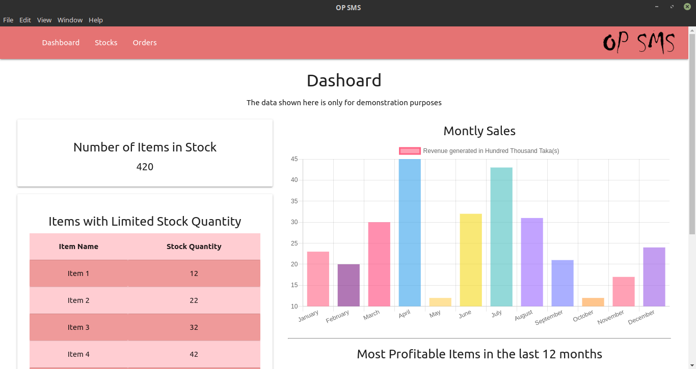
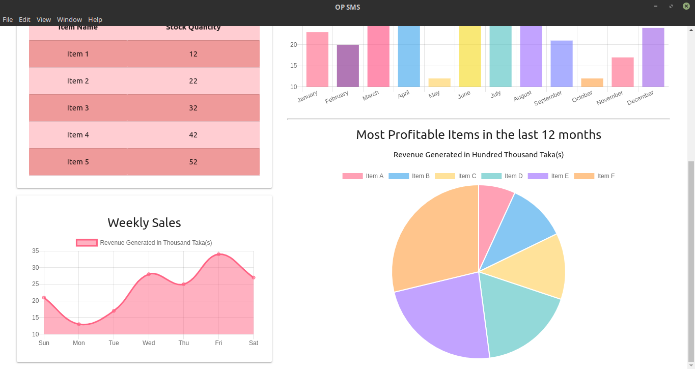
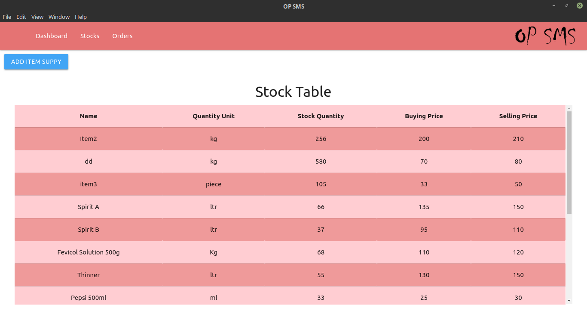
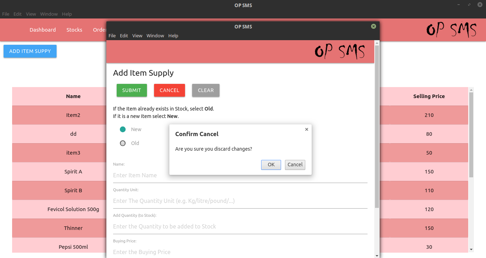
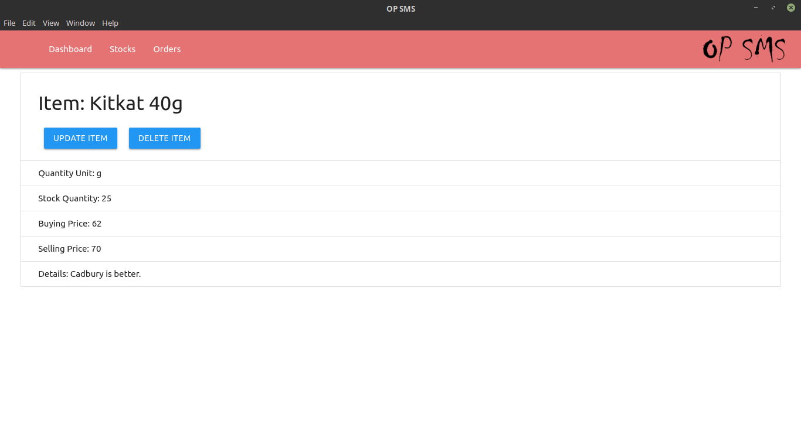
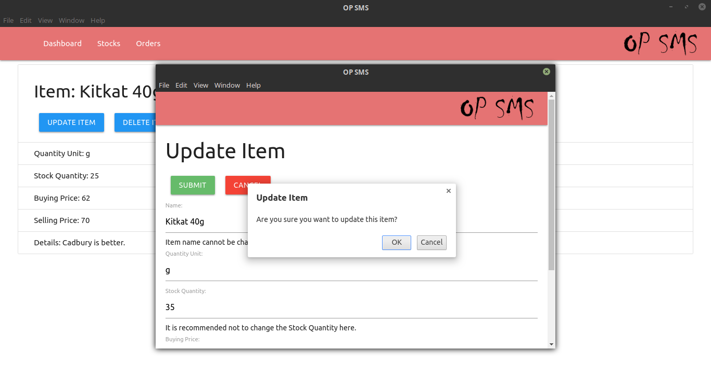
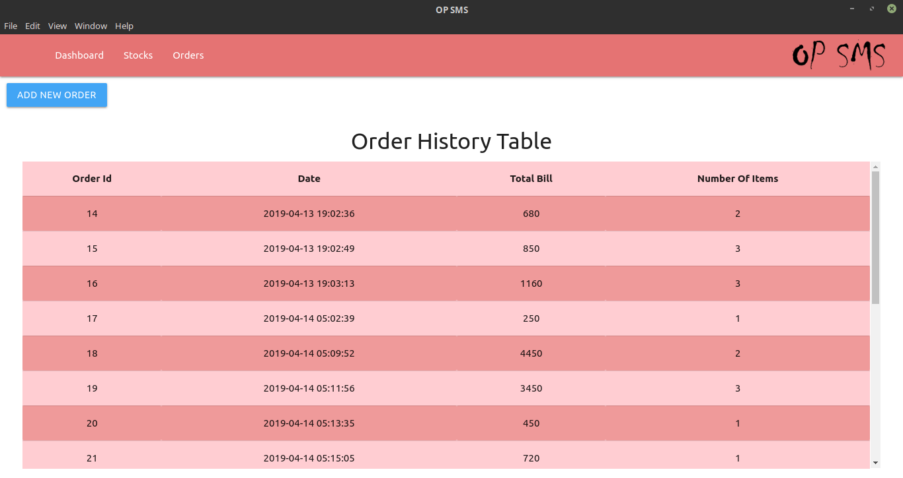
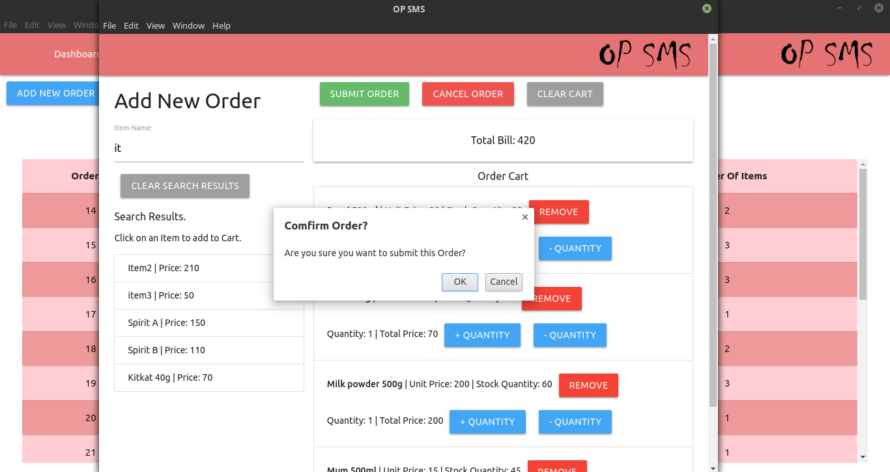
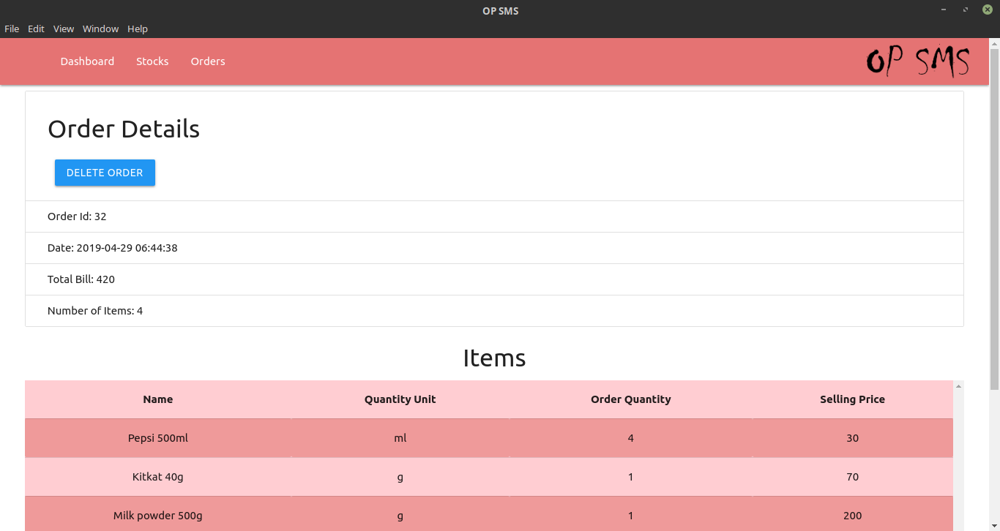

# OP Store Handler

A Desktop Store-Management-System built on ElectronJS and ReactJS.

## Dependencies/Stack

Front-end: ReactJS, materialize CSS, chartJS

Back-end: ElectronJS

DB: Sqlite3

## Sample Images

  
  
  
  
  
  
  
  
  

## License

GNU
